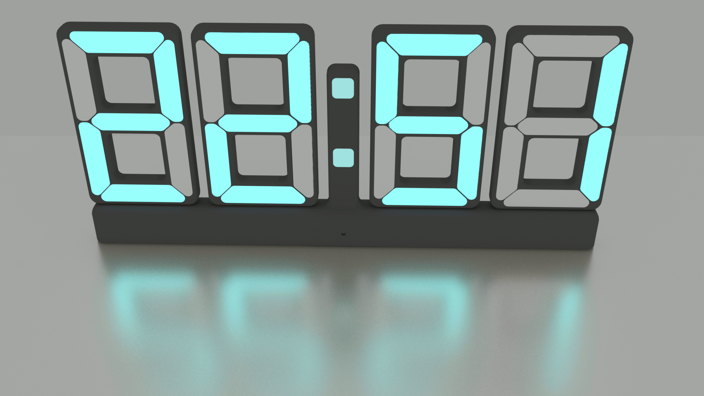

# LED Clock

The LED Clock uses WS2812 (NEOPixel) LEDs to emulate a seven segment clock. It is mainly intended to be used in the bedroom, to get to know the time whenever you wake up. Therefore, the clock has a "dark mode", switching the LEDs to a faint red tone, to have less impact on the sleep. The idea behind this project arose, as it is difficult by people wearing glasses, to read a common bedside clock display, when not wearing glasses at night. The LED concpet allows the display to be very big, providing better readability.

The Clock uses an ESP8266 microprocessor, programmed using the Arduino IDE to obtain the current time from a time server and subsequently driving the LEDs to show the time. The ESP8266 also reads out a light sensor to obtain the current room illumination and control the brightness of the display.

## Build Instructions

### Bill of Materials

The housing of the clock is custom designed and intended to be 3D printed. It is designed, so that it will be printable on most hobbyist 3D printers. 

The following parts must be printed:

Quantity | Suggested Color | Part File Name 
--- | --- | ---
4 | Black | LED_Clock_Housing-DigitBackShell.stl 
4 | White | Digit_Diffusor_Set.stl
1 | Black | LED_Clock_Housing-Base Left.stl
1 | Black | LED_Clock_Housing-Base Right.stl
1 | Black | LED_Clock_Housing-Base Middle.stl

The following electronic components are needed:

Quantity | Component Name
--- | --- 
1 | ESP8266 NodeMCU Board (e.g. https://www.az-delivery.de/products/nodemcu) 
1 | 500813 Phototransistor
1 | WS2812 LED Strip (86 LEDs long)
2 | 3 Position Wago Clapms
1 | Small Piece of perfboard
1 | 10 kOhm resistor

### Digit Assembly

3D print four pices of the file LED_Clock_Housing-DigitBackShell.stl . The recommended material for the print is black PLA. Cut the WS2812 LED strip into 7 pieces of 3 LEDs each. Then glue the LED strip pieces into one of the digit back shells, as seen in the following picture. Pay particular attention to have the Di and Do solder pads in the correct position. Cut connecting cables into 30mm pieces and use them to connect the LED strip pices as in the following picture. Below, red is used for +5V, black is used for Ground and yellow is used for the signal. Pay particular attention to wire the Di/Do signal path, as this will determine the order of the LEDs.

3D print four times the file Digit_Diffusor_Set.stl. The recommended material is white PLA. Print it from a full material, to avoid shine through of the infill structure in the final application.

### Light Sensor Assembly
Take a small piece of perfboard and solder the phototransistor and the 10 kOhm resistor on it. The resistor is connected to the emitter of the phototransistor. Solder three cables to the collector of the Phototransistor, the emitter of the phototransistor and the pin of the resistor, that is not connected to the phototransistor.

### Clock Assembly
3D print one piece of the file LED_Clock_Housing-Base Left.stl. Put a bit of hot glue into the two arresting holes for the outermost digit and then put the first digit in the outer position. Take care of the orientation of the digit, with respect to the cable feedthrough on the side. The digit looks to the front, when the cable feedtrough is on the left.

Put the ESP8266 board in and connect the +5V pin of the digit in Port (as indicated in the above picture) to VIN of the NodeMCU. Connect the GND signal to ground. Connect the DIN signal of the port to pin D8 of the NodeMCU board. Feed the cable through the slit in the bottom of the digit.
Connect the Digit Out port of the leftmost digit with the Digit in port of the next digit. Connect +5V to +5V, GND to GND and DO to DI.
After soldering in the conections, put in the diffusors.

Print one piece of the part LED_Clock_Housing-Base Middle.stl. Cut two LEDs from the LED strip and glue them into the two places for the dots. Take care of the orientation while doing so. Connect the +5V, GND and DO to DIN from the bottom to the top LED, as in the picture. Solder a 45 cm long cable to the DO signal of the upper LED. This will connect to the third digit later on. Solder a 35 cm long cable to the Din pin of the lower LED. This will connect to the DO signal of the Digit out port of the second digit. Solder two 10 cm long cables to the +5V and GND of the lower LED. Take two Wago clamps with three positions each and clamp the ground and +5V cable to the middle positions.

Glue the phototransistor PCB into the samll hole in the front of the middle part, beeing carefull, that no glue is covering the phototransistor itself. Connect the collector of the phototransistor to the +3.3V pin of the ESP8266 board, the emitter to the A0 pin and the other side of the resistor to the GND pin.

Solder two 20 cm long cables to the GND and +5V of the Digit Out port of the second digit. Connect those to the +5V and GND Wago clamps respectively.
Coat the overlapping area between the left and middle base with hot glue and glue it together.

Print one piece of the file LED_Clock_Housing-Base Right.stl. Glue the digits 3 and 4 in with a bit of hot glue. Connect the cable coming from the DO pin of the upper LED of the middle base part to the DIN of the 3rd digit. Connect the +5V and GND signals of that digits Digit In port to the respective +5V and GND Wago clamps. Connect the Digit Out port of the 3rd digit and the Digit in port of the fourth digit together, similar to the first and second digit.

After all the connections are done, secure the board and the cables with a bit of hot glue.

### Software Upload

To upload the software, open the Arduino IDE and select the NodeMCU 1.0 board. If you do not have the ESP8266 installed in the Arduino IDE, you can follow this tutorial to do so (https://randomnerdtutorials.com/how-to-install-esp8266-board-arduino-ide/). 

This software uses the Neopixel library by Adafruit to control the WS2812 LEDs. To install this library go to Tools -> Library Manager and search for the library "Adafruit NeoPixel". Install version 1.12.0 of this library.

In the file config.h, the WIFI SSID and password must be set correctly, to enable access to an NTP server on the internet. The correct time zone must also be configured. A list of time zone configurations can be accessed here: https://github.com/nayarsystems/posix_tz_db/blob/master/zones.csv.

